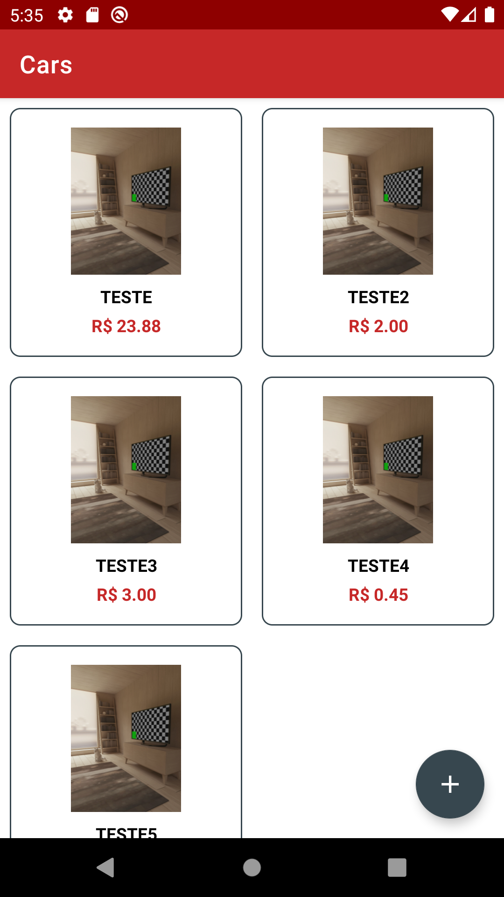
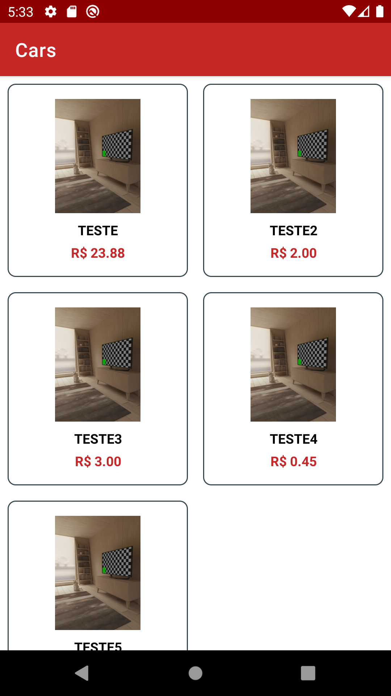
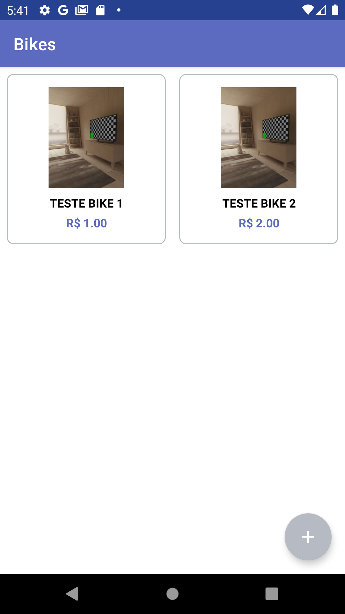
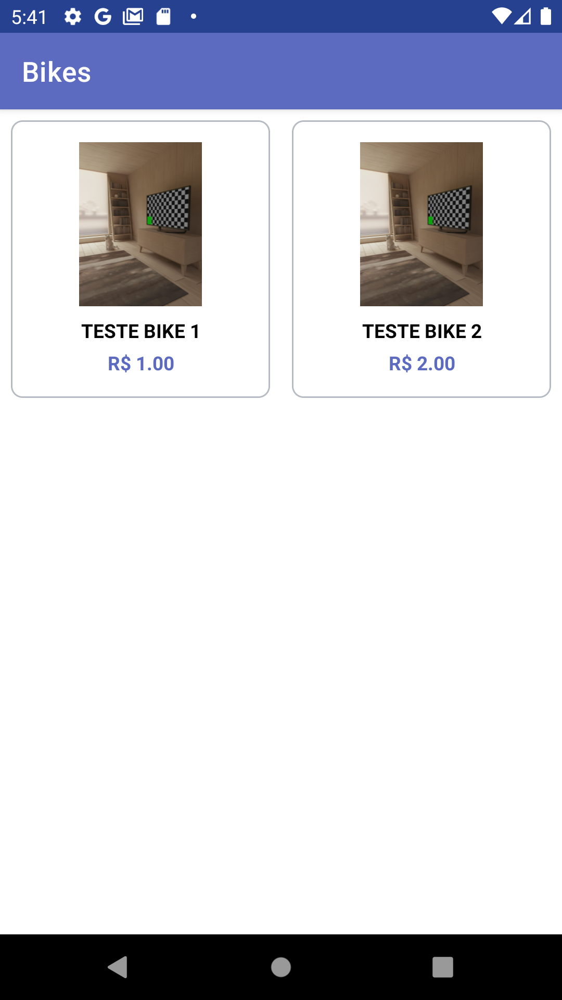
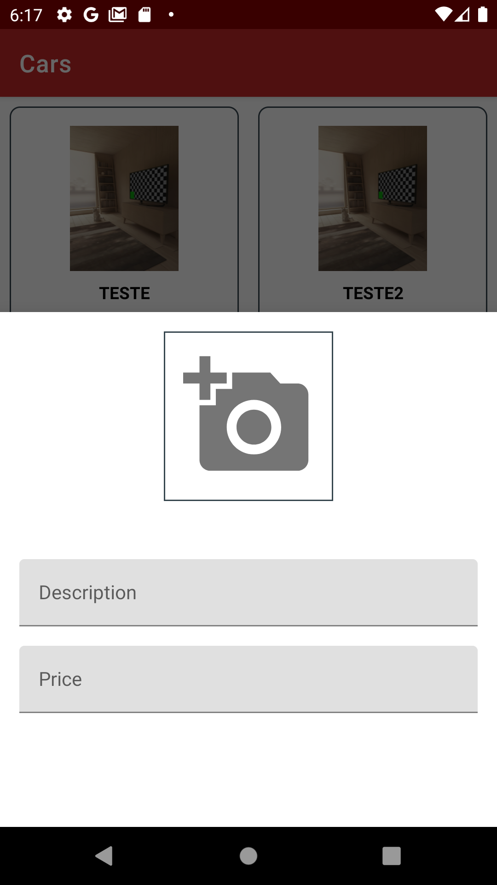

# WL-Flavors

Projeto white label para praticar conceitos de criação de Product Flavors, utilizando melhores praticas com MVVM e Clean Architecture, separando o app pela flavors de cliente e administrador e flavors Carro e bike.

##  Tecnologias utilizadas

1. MVVM e Clean Architecture
2. Material Design
3. Firebase (storage e firestore)
4. Coroutines
5. Hilt
6. Navigation
7. Glide

|  |   | 
|:------------------------: | --------------------------- |
 | Tela Admin | Tela Cliente|
|  |  |
 | Tela Admin | Tela Cliente|
|  |
| Tela Criação produto|
